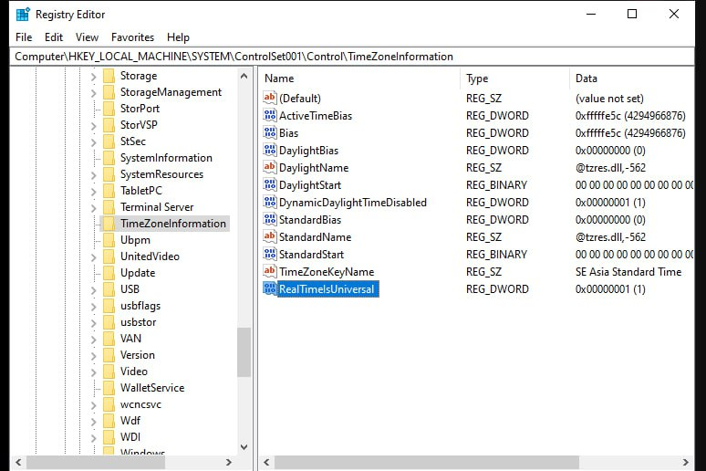
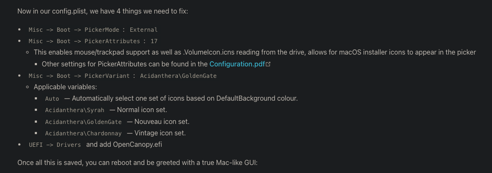

### Fix 'zsh: permission denied: file command'
- Open terminal in file and run:
```
chmod +x 'file name'
```

### Remove delay auto hidden dock

defaults write com.apple.dock autohide-delay -float 0;killall Dock

### Install Git

```
chmod u+x path/install.sh
```

```
sudo apt install git -y

git config --global user.name "MinhTD"
git config --global user.name "tranminhsvp@gmail.com"

ssh-keygen -t ed25519 -C "tranminhsvp@gmail.com"

```

### Install zsh & oh-my-zsh

```
brew install zsh
```

```
sh -c "$(curl -fsSL https://raw.githubusercontent.com/robbyrussell/oh-my-zsh/master/tools/install.sh)"
```

```
git clone https://github.com/zsh-users/zsh-autosuggestions ${ZSH_CUSTOM:-~/.oh-my-zsh/custom}/plugins/zsh-autosuggestions

git clone https://github.com/zsh-users/zsh-syntax-highlighting.git ${ZSH_CUSTOM:-~/.oh-my-zsh/custom}/plugins/zsh-syntax-highlighting

git clone https://github.com/zsh-users/zsh-completions ${ZSH_CUSTOM:-${ZSH:-~/.oh-my-zsh}/custom}/plugins/zsh-completions
```

```
nano .zshrc
```

```
ZSH_THEME="agnoster"
```

```
plugins=(
    zsh-autosuggestions zsh-completions zsh-syntax-highlighting git aliases
)
```

```
source .zshrc
```

### Install theme agnoster

- Find location .oh-my-zsh: `home/.oh-my-zsh/themes`
- Replace file [theme](./agnoster.zsh-theme)
- Run command and successfully

```
AGNOSTER_PATH_STYLE=shrink
```

### Enable Hidpi

```
bash -c "$(curl -fsSL https://raw.githubusercontent.com/xzhih/one-key-hidpi/master/hidpi.sh)"
```

### Fix audio

- Audio codec `ALC887` support: 0x100202, 0x100302, layout 1, 2, 3, 5, 7, 11, 12, 13, 17, 18, 20, 33, 40, 50, 52, 53, 87, 99
- Audio codec `ALC897` support: 0x100402, 0x100500, layout 11, 12, 13, 21, 23, 66, 69, 77, 98, 99
- To test out our layout IDs, we're going to be using the boot-arg `alcid=xxx` (recommend `alcid=11`) where xxx is your layout. Remember that to try layout IDs one at a time. Do not add multiple IDs or alcid boot-args, if one doesn't work then try the next ID and etc

```
config.plist
├── NVRAM
  ├── Add
    ├── 7C436110-AB2A-4BBB-A880-FE41995C9F82
          ├── boot-args | String | alcid=11
```

### [Fix mouse not working safari](https://github.com/archagon/sensible-side-buttons)

### [Fix Bluetooth](https://dortania.github.io/OpenCore-Install-Guide/ktext.html#wifi-and-bluetooth)

### Fix wrong date-time dual boot



### Chanage boot default opencore

- Hold Ctrl and enter boot item.

### Download [m3u8](https://greasyfork.org/en/scripts/449581-m3u8%E8%A7%86%E9%A2%91%E4%BE%A6%E6%B5%8B%E4%B8%8B%E8%BD%BD%E5%99%A8-%E8%87%AA%E5%8A%A8%E5%97%85%E6%8E%A2)

### Fix lag mouse

- Remove all `Library/Caches`

#### Unzip multi files

- Cho vào cùng 1 folder
- cmd:

```
cd vào folder chứa file

unzip '*.zip' -d ./
```

### Crack Jetbrain

```
xattr -cr /Applications/IntelliJ\ IDEA.app

xattr -cr /Applications/WebStorm.app

xattr -cr /Applications/PyCharm.app
```

###

```
allow pasting
```

```
var styles = `
  .mc_live .mc_l-right{
    display: none
  }
  .mc_live .mc_l-left {
      width: calc(100% - 0px);
      float: left;
  }
`

var styleSheet = document.createElement("style")
styleSheet.textContent = styles
document.head.appendChild(styleSheet)
```

### Remove file `.DS_Store`

```
find . -name ".DS_Store" -print -delete
```

### [Fix gui picker opencore](https://dortania.github.io/OpenCore-Post-Install/cosmetic/gui.html#setting-up-opencore-s-gui)



###

```
brew install MonitorControl
```
