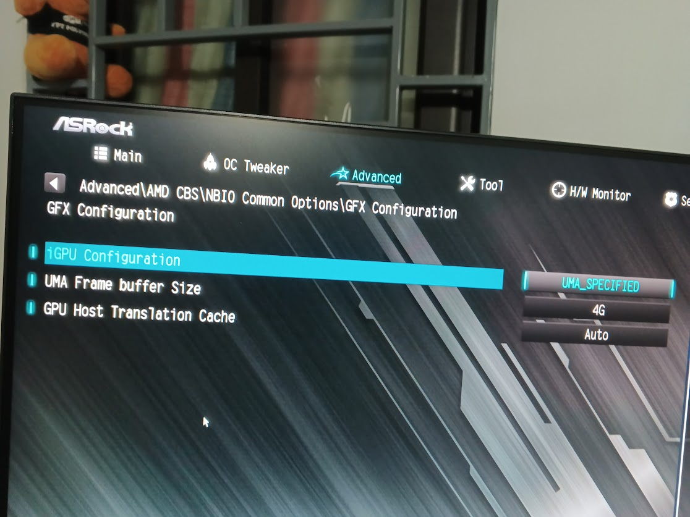

### Remove delay auto hidden dock

defaults write com.apple.dock autohide-delay -float 0;killall Dock

### Fix Vram igpu amd



### Install Git

```
sudo apt install git -y

git config --global user.name "MinhTD"
git config --global user.name "tranminhsvp@gmail.com"

ssh-keygen -t ed25519 -C "tranminhsvp@gmail.com"

```

### Install zsh & oh-my-zsh

```
brew install zsh
```

```
sh -c "$(curl -fsSL https://raw.githubusercontent.com/robbyrussell/oh-my-zsh/master/tools/install.sh)"
```

```
git clone https://github.com/zsh-users/zsh-autosuggestions ${ZSH_CUSTOM:-~/.oh-my-zsh/custom}/plugins/zsh-autosuggestions

git clone https://github.com/zsh-users/zsh-syntax-highlighting.git ${ZSH_CUSTOM:-~/.oh-my-zsh/custom}/plugins/zsh-syntax-highlighting

git clone https://github.com/zsh-users/zsh-completions ${ZSH_CUSTOM:-${ZSH:-~/.oh-my-zsh}/custom}/plugins/zsh-completions
```

```
nano .zshrc
```

```
ZSH_THEME="agnoster"
```

```
plugins=(
    zsh-autosuggestions zsh-completions zsh-syntax-highlighting git
)
```

```
source .zshrc
```

### Install theme agnoster

- Find location .oh-my-zsh: `home/.oh-my-zsh/themes`
- Replace file [theme](./agnoster.zsh-theme)
- Run command and successfully

```
AGNOSTER_PATH_STYLE=shrink
```

### Enable Hidpi

```
bash -c "$(curl -fsSL https://raw.githubusercontent.com/xzhih/one-key-hidpi/master/hidpi.sh)"
```

### [Map keyboard](https://karabiner-elements.pqrs.org)
